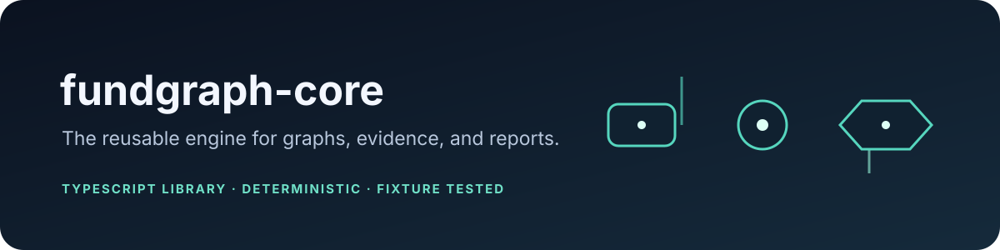

<p align="center"></p>

<p align="center">
  <a href="LICENSE"></a>
  
  
</p>

# fundgraph-core

The reusable TypeScript library behind FundGraph. Core owns dependency discovery, versioned models, evidence parsing,
relationship resolution, and deterministic reports. It contains no terminal UX or payment behavior.

## Package status

Version `0.1.0` is prepared locally and is not yet published to npm. The project-level mission, roadmap, security policy,
and cross-repository decisions are maintained in the separate `fundgraph` project repository.

## Capabilities

### Local dependency discovery

`discoverDependencies(path)` reads local manifests and lockfiles for:

| Ecosystem | Inputs | Current notes |
|---|---|---|
| npm | `package.json`, `package-lock.json` | Aliases, workspaces, optional dependencies, transitive lockfile edges |
| PyPI | `pyproject.toml`, `requirements.txt`, `poetry.lock` | Optional dependencies and available lockfile edges |
| Cargo | `Cargo.toml`, `Cargo.lock` | Workspaces, optional dependencies, available lockfile edges |
| Go | `go.mod` | Module path and `require` entries; no `go.work`, fetch, or transitive graph expansion |

The reader treats project files as data, enforces size limits, and reports malformed or missing inputs through diagnostics.
It does not run package managers, build tools, or the Go toolchain.

### Metadata and funding evidence

`parseRegistryMetadata` normalizes recorded npm, PyPI, and crates.io payloads. Funding parsers accept package metadata,
GitHub `FUNDING.yml`, and recorded public provider responses. Parsers preserve source, parser, timestamp, and the original
bounded observation as evidence; they do not make hidden requests.

Go metadata and funding providers are not implemented.

### Relationship and report APIs

`resolveFundingRelationships(input)` emits explicit `supported`, `ambiguous`, `contradictory`, or `unresolved` states
with rule IDs, evidence IDs, and confidence. `createReport(input)` produces a versioned report with stable ordering,
diagnostics, evidence drill-down, limitations, and informational actions. Text output escapes terminal control characters;
JSON output is stable. No action is executed.

### Optional network helpers

`NetworkClient` provides bounded retries, timeouts, cancellation, rate-limit handling, opt-in TTL caching, offline replay,
and partial batch results. Public credential-free HTTPS is the default; private/local destinations and redirects are
rejected. Authenticated requests are not cached. Callers remain responsible for deployment-level DNS/network isolation.

## Minimal usage

```ts
import { discoverDependencies } from '@fundgraph/core';

const result = discoverDependencies('./my-project');
console.log(result.ecosystems);
console.log(result.graph.nodes.map(({ packageId, resolvedVersion }) => ({ packageId, resolvedVersion })));
console.log(result.diagnostics);
```

This example discovers dependencies only. To parse funding evidence and resolve relationships, call the dedicated core
APIs with recorded payloads and explicit evidence inputs; the CLI does not yet orchestrate that entire workflow.

## Development

```sh
npm ci
npm run lint
npm run typecheck
npm test
npm run build
npm pack --dry-run
```

The test fixtures live under `test/fixtures/`; the integration matrix is at
[`test/fixtures/integration/fixture-matrix.json`](test/fixtures/integration/fixture-matrix.json). The CI workflow defines
Ubuntu, Windows, and macOS jobs on Node 20 and 22.

## Contributing

See [`CONTRIBUTING.md`](CONTRIBUTING.md). For a new adapter or fixture, follow the `fundgraph` project's adapter guide
and compatibility policy. Keep parsing deterministic and fixture-driven.
